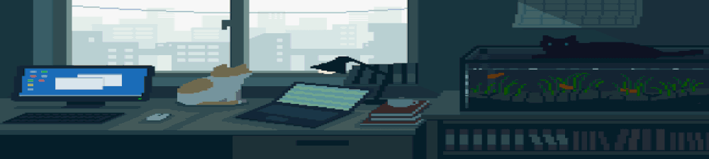

#  Hi, I'm Nicolas Esteban (Nekolas) 

### 💻 Frontend Developer | Web Performance & SEO Enthusiast

  

  
Estudiante de Ingeniería de Software en la <a href="https://www.upc.edu.pe/">Universidad Peruana de Ciencias Aplicadas</a> ♨️, apasionado por diseñar <strong>experiencias de usuario intuitivas y agradables</strong>. Disfruto colaborar en el desarrollo de <strong>proyectos con impacto social</strong>, incluyendo <strong>organizaciones y comunidades</strong> que contribuyan a generar un cambio positivo :D

  
### 🧐 More About Me:

  

    
• 🚀 I’m currently learning <strong>Astro</strong> & <strong>Express</strong>

    
• 🤝 Looking to collaborate on <strong>social impact projects</strong> within communities

    
• 🎨 Trying to get better at <strong>design</strong>

    
• 📖 Currently reading <strong>Refactoring UI</strong> by Adam Wathan

    
• 📝 Check out my <a href="#">resume</a> or linkedin

    
• 🎮 In my free time, I enjoy <strong>playing indie games
    
• 💬 Ask me about <strong>CSS, Web Performance</strong> and <strong>frontend best practices</strong>

  

### 🔨 Languages and Tools:

  

### 🤝 Connect with Me  

  
  
  
  
  

### 📈 Contributions & Stats

  
  

